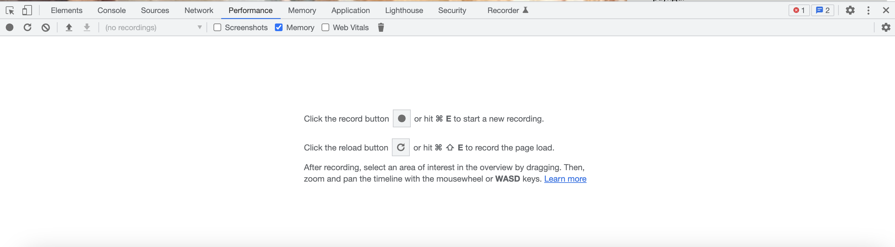
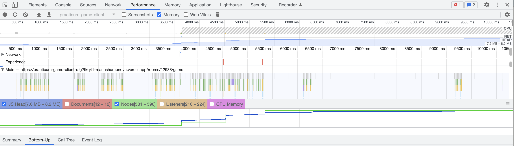
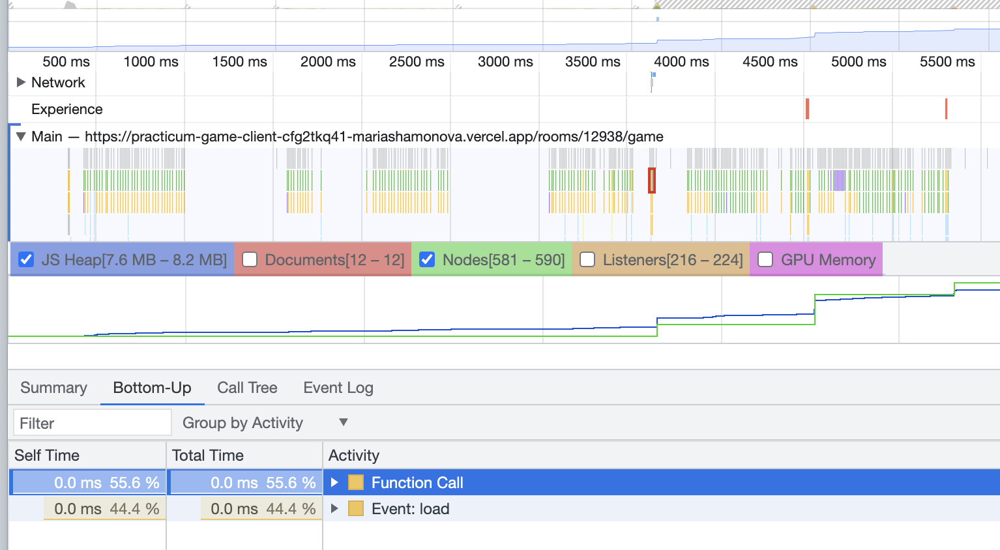
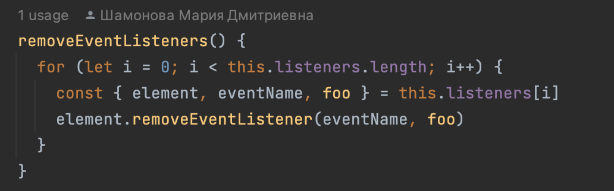
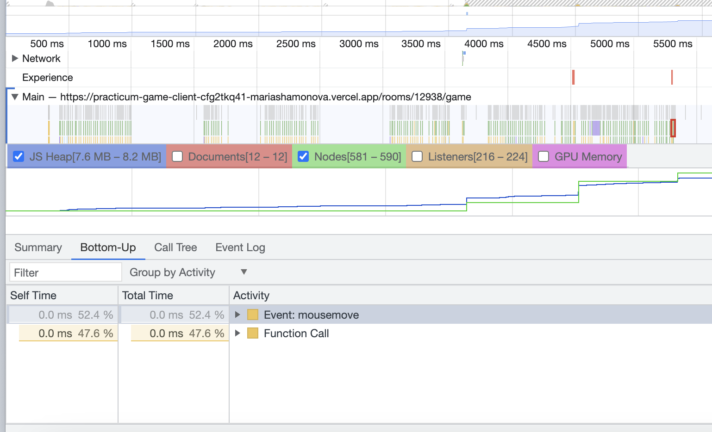
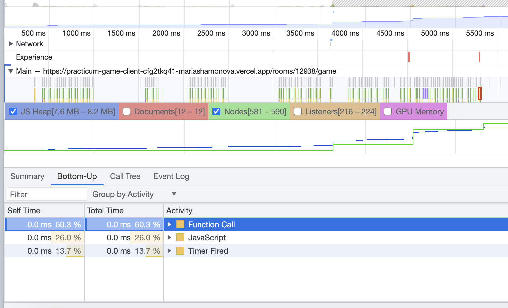
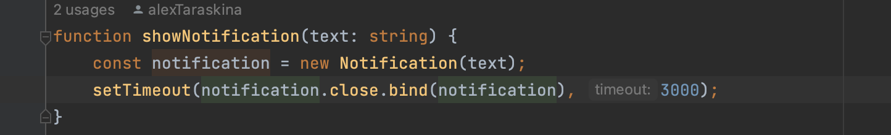
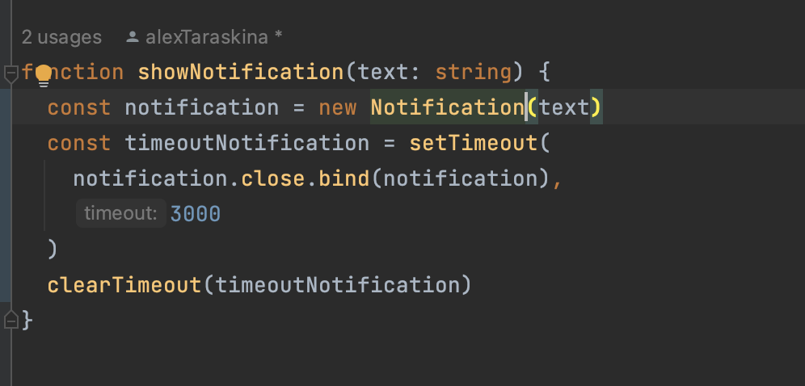
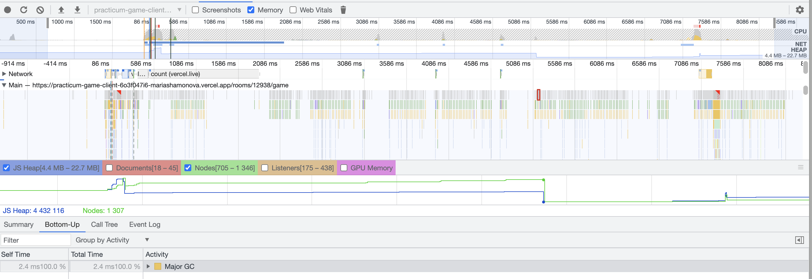

# Поиск утечек памяти

Браузеры автоматически управляют памятью веб-страниц. 
Когда веб-страница создает какой-либо объект, 
браузер выделяет фрагмент памяти для хранения этого объекта. 
Так как память — ограниченный ресурс, браузер выполняет сборку мусора. 
Это позволяет определить, что тот или иной объект больше не нужен, 
и можно освободить занимаемый им фрагмент памяти. 
Тем не менее функция обнаружения работает неидеально. 
Поэтому необходимо самостоятельно следить за использованием памяти веб-страницей.

Для поиска утечек памяти воспользуемся вкладкой Performance Chrome Devtools, которая позволяет измерять загрузку страницы веб-сайта.

Для начала записи производительности страницы нужно нажать на кнопку Record в левом верхнем углу панели.
Чтобы определить какие именно методы, прослушиватели и объекты могут вызывать утечки, 
нужно выполнить на странице какие-либо действия и после этого остановить запись.

После остановки записи появляется информация по производительности веб-страницы.

На графике JS Heap мы видим, что за время записи память увеличилась с 7.6 MB до 8.2 MB, а график имеет восходящую тенденцию.

Это значит, что на странице есть утечки памяти.

Первое увеличение памяти было во время вызова функции createCardImage() 
в классе Board, котора вешает слушатель события 'load' на изображение и 
после того, как картинка была загружена, слушатель не удаляется.

Утечка была исправлена удалением слушателя 'load' при вызове функции clearCard()

Второе увеличение памяти было вызвана слушателем события 'blur', однако найти элемент, на котором висит это событие, не удалось.

Третье увеличение памяти было вызвано срабатыванием setTimeout в файле notifications.js и произошла утечка, потому что после вызова функции таймаут не удаляется из памяти.

После удаления слушателя 'load' и функции setTimeout утечек не обнаружено.

